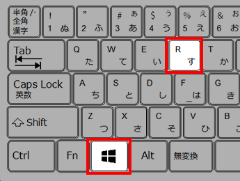
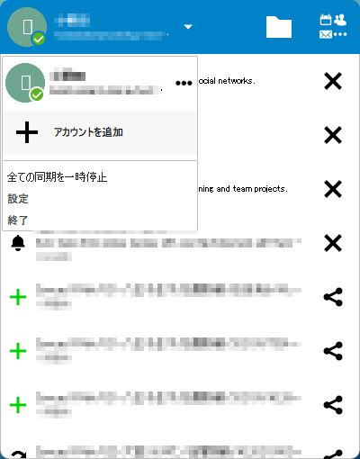

1. キーボードの［Windows］キーを押しながら、［R］キーを押します。

1. 入力欄に `%PROGRAMFILES%\Nextcloud\nextcloud.exe` と入力し、［OK］ボタンをクリックします。
1. 「▼」をクリックし、「アカウントを追加」をクリックします。

1. 続きは[同期設定(Windows版)](/setup-nextcloud/#sync-win)を参考に同期設定を行います。