

クラウドストレージサービスでは「同期クライアント」を利用することで、個人所有のパソコンやスマートフォンとの間でファイルの同期をとることができます。

同期クライアントを利用するためには、以下の手順に従ってインストールおよびセットアップを行ってください。

- [同期クライアント利用時の注意事項](#caution)
- [インストール(Windows版)](#install-win)
- [同期設定(Windows版)](#sync-win)
- [インストール(Mac版)](#install-mac)
- [同期設定(Mac版)](#sync-mac)

<section id="caution">

## 同期クライアント利用時の注意事項

- スマートフォン等のテザリングで同期クライアントを利用する場合は、データ使用量に注意してください。
- 共有ファイルを複数のユーザーが同時に開いた場合は、conflictファイルが生成されます。  
※更新したファイルはアップロードされず、別ファイルとしてconflictファイルが生成されます。
- 共有中のフォルダーに大容量ファイルをアップロードすると、同期に時間がかかります。同期クライアントの設定で、ダウンロード制限を行うことを推奨します。
- 同期対象ファイルの総容量には注意してください。

</section>

[ページ先頭へ](#pagetop)

<section id="install-win">

## インストール(Windows版) </h2>

1. <a href="https://nextcloud.com/install/#install-clients" target="_blank">https://nextcloud.com/install/#install-clients</a>から同期クライアントをダウンロードし、インストーラを起動します。

1. インストーラを起動すると下記画面が表示されるので、[次へ] をクリックして先に進んでください。
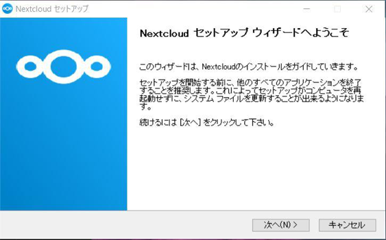

1. インストールするコンポーネントの選択画面が表示されますが、特に変更の必要はありません。そのまま [次へ] をクリックします。
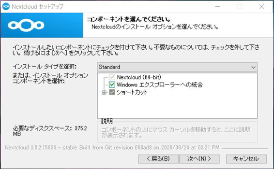

1. インストール先ディレクトリの指定画面が表示されますが、特に変更の必要はありません。そのまま [インストール] をクリックします。
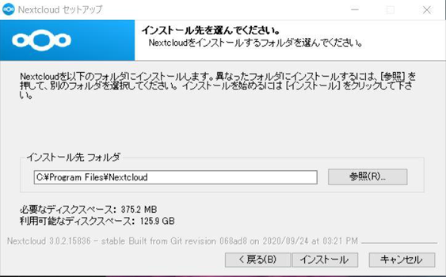

1. インストール作業が行われ、インストール作業が完了します。[次へ] をクリックします。
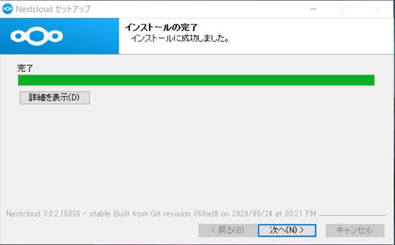

1. 同期クライアントのインストールが完了しました。引き続き、次項からの「同期設定」を行うため、[Nextcloudを実行] にチェックを入れたまま [完了] をクリックしてください。
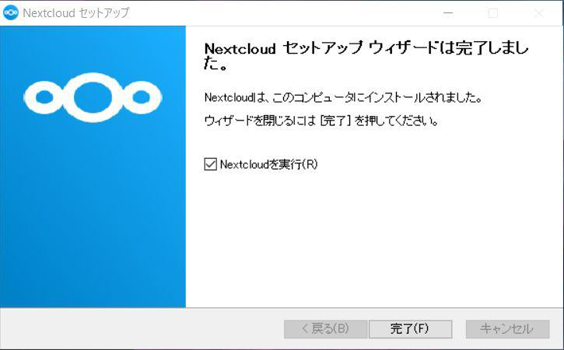

</section>

<section id="sync-win">

## 同期設定(Windows版)
1. 同期クライアントのインストールが完了すると、下図のような [Nextcloud 接続ウィザード] の画面が表示されます。[ログイン] をクリックして、[次へ]をクリックします。
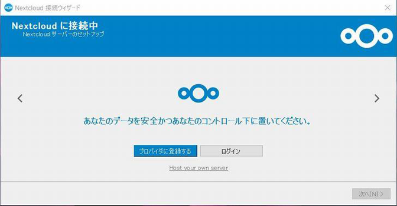

1. 下図のような [Nextcloud 接続ウィザード] の画面が表示されます。  
サーバアドレスに[http://2cott.starfree.jp/nextcloud]を入力し、[次へ] をクリックします。  
※入力時には、コロン[:]とカンマ[;]が間違っていないか、半角スペースなどが含まれていないか、などを確認ください。 
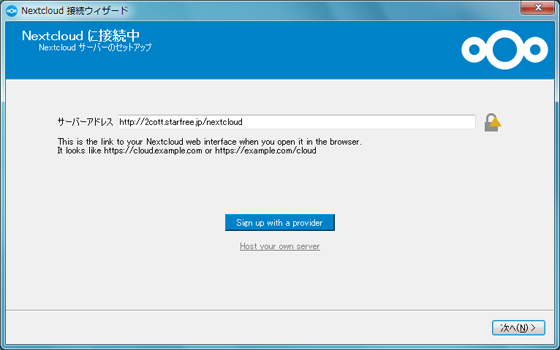

1. 下図のような画面が表示され、続いてブラウザ画面も表示されます。
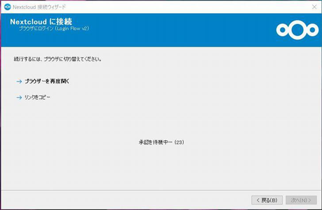

1. ブラウザ画面に切り替え、下図のような[あなたのアカウントに接続する]画面の[ログイン]をクリックします。
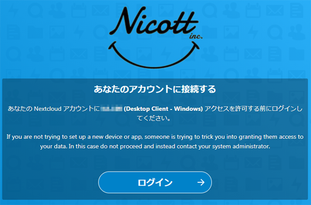

1. 認証システムの画面が表示されます。ユーザ名とパスワードを入力して[ログイン]をクリックします。
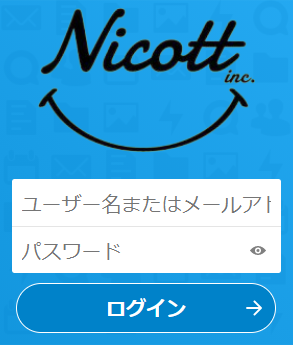

1. [アカウントによるアクセス許可]の画面が表示されます。[アクセスを許可]をクリックします。
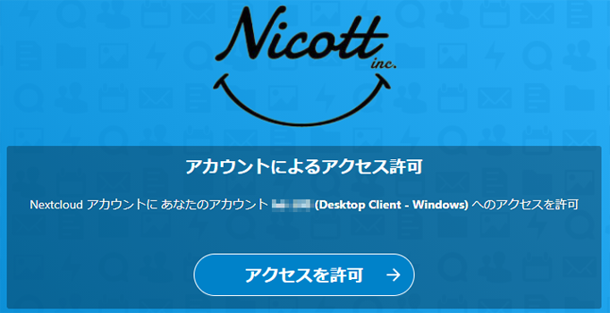

1. [アカウント接続済]の画面が表示されます。この画面を閉じてください。
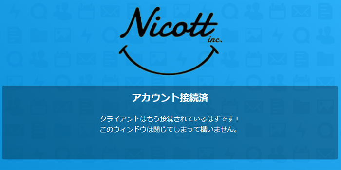

1. [Nextcloud 接続ウィザード] の画面に戻り、[ローカルフォルダのオプションのセットアップ]画面が表示されます。[同期フォルダーを選択]をクリックし、同期したいフォルダにチェックを入れ[OK]をクリックした後、[接続] をクリックします。 
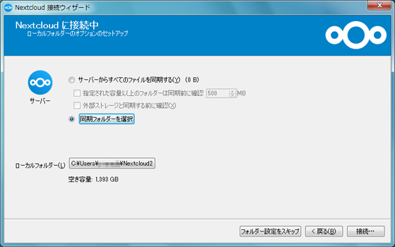

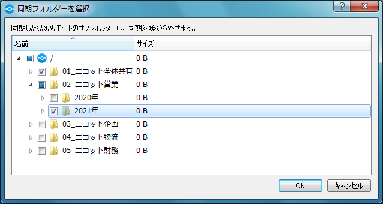

</section>

<section id="install-mac">

## インストール(Mac版)
1. <a href="https://nextcloud.com/install/#install-clients" target="_blank">https://nextcloud.com/install/#install-clients</a>から同期クライアントをダウンロードし、インストーラを起動します。  
※OSがダウンロードの許可を求める場合は、許可をして操作を進めてください。 

1. インストーラを起動すると下記画面が表示されるので、[続ける] をクリックします。  
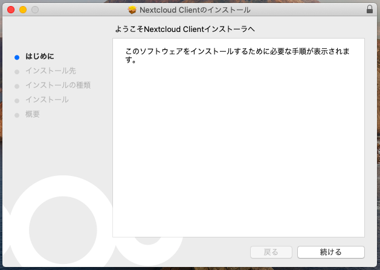

1. インストール先の選択画面が表示されるので、[続ける] をクリックします。  
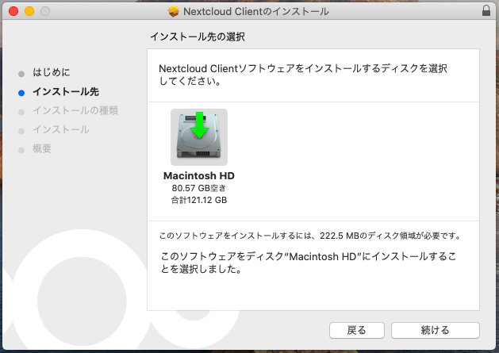

1. インストールに必要なディスク容量が表示されるので、[インストール] をクリックします。  
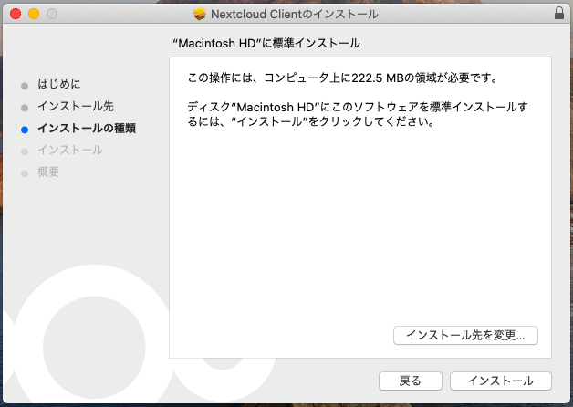

1. Macにソフトウェアをインストールするため、管理者情報が求められます。Macの管理者アカウントの情報を入力し、[ソフトウェアをインストール] をクリックします。  
※途中、OSが操作の許可を求める場合は、[OK]で操作を許可して進めてください。  
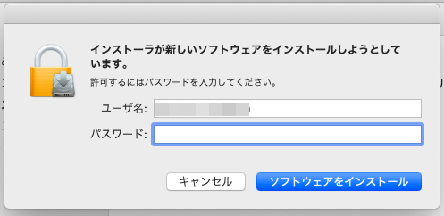

1. インストール作業が行われ、インストール作業が完了します。[閉じる] をクリックします。  
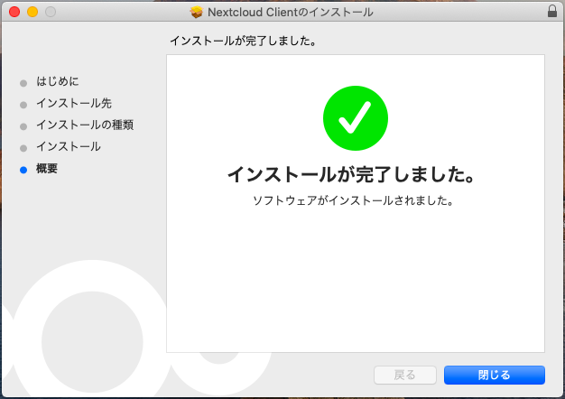

</section>

<section id="sync-mac">

## 同期設定(Mac版)
1. アプリケーションの一覧からNextcloudを起動します。
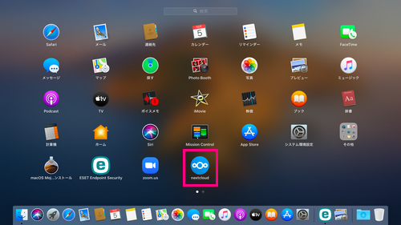

1. 続きは[同期設定(Windows版)](#sync-win)を参考に同期設定を行います。

</section>
